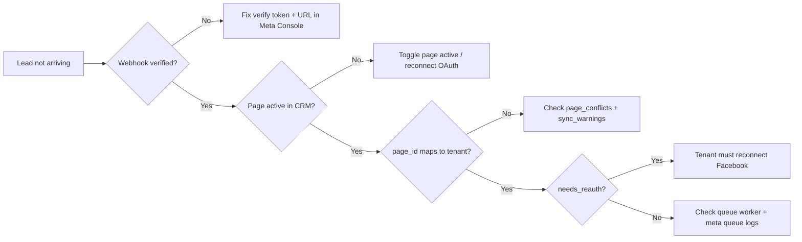

# Meta Shared App Runbook

Operational guide for the shared Meta (Facebook) application integration after migration from per-tenant apps.

## Architecture Summary

- **One Meta App** configured in Super Admin → System Integrations
- **One global webhook**: `{API_URL}/api/meta/webhook`
- **Tenant routing** by `page_id` in webhook payloads
- **Tenant OAuth** links Facebook accounts and syncs pages/ad accounts
- **Data deletion** callback: `POST /api/facebook/data-deletion`
- **Deletion status page**: `{FRONTEND_URL}/privacy/dataDeletion?code={confirmation_code}`

## Meta Developer Console Checklist

1. Open [Meta Developers](https://developers.facebook.com/apps/) and select the shared app.
2. **Facebook Login** → Valid OAuth Redirect URIs:
   - `{API_URL}/api/auth/meta/callback`
3. **Webhooks** → Page subscription:
   - Callback URL: `{API_URL}/api/meta/webhook`
   - Verify Token: same value as Super Admin `meta_verify_token`
   - Subscribe to `leadgen`
4. **App Review** (if required):
   - Data Deletion Callback URL: `{API_URL}/api/facebook/data-deletion`
   - Data Deletion Status URL: `{FRONTEND_URL}/privacy/dataDeletion`
5. Ensure app has permissions: `leads_retrieval`, `pages_manage_metadata`, `pages_show_list`, `ads_read`, `business_management`.

## Deployment Commands

```bash
php artisan migrate
php artisan meta:invalidate-connections
php artisan settings:encrypt-secrets   # optional: migrate legacy plaintext Google secrets
php artisan test --filter="Meta|SharedMeta|GoogleSecret"
```

## Post-Deploy Tenant Reconnect Flow

1. Run `meta:invalidate-connections` to mark all connections `needs_reauth=true`.
2. Tenant admins receive in-app + email notification to reconnect.
3. Each tenant opens **Marketing → Meta Integration** and clicks **Add New Account**.
4. After OAuth, `syncAssets` runs and **auto-subscribes** active pages to `leadgen` webhook.
5. Super Admin verifies webhook: **System Integrations → Verify Webhook**.

## Health & Monitoring

### Super Admin endpoints

| Endpoint | Purpose |
|----------|---------|
| `GET /api/super-admin/meta/health` | Global metrics (tenants, pages, conflicts, rate limits) |
| `POST /api/super-admin/meta/test-webhook` | Verify token challenge test |

### Tenant endpoints

| Endpoint | Purpose |
|----------|---------|
| `GET /api/auth/meta/status` | Connection status + `sync_warnings` |
| `GET /api/auth/meta/health` | Tenant-scoped diagnostics |

### Key metrics

- `page_conflicts` — same `page_id` linked to multiple tenants (blocked by design)
- `connections_needing_reauth` — tenants that must reconnect OAuth
- `rate_limit_events_24h` — Meta API rate limit counter (codes 4/17/32/613)
- `rate_limit_recent` — last 20 rate-limit events (endpoint, code, timestamp) for Super Admin dashboard
- `subscribe_summary` — webhook auto-subscribe results per sync

## Tenant Go-Live Checklist

Tenants can review readiness in **Marketing → Meta Integration → Go-Live** tab. The checklist combines:

- **Automated checks** from `/api/auth/meta/status` (`go_live` payload)
- **Manual platform items** (Meta Console webhook, queue worker, token refresh cron) — confirm with DevOps

## Troubleshooting Leads



1. **Webhook not verified** — run Super Admin "Verify Webhook"; match token in Meta Console.
2. **Page not subscribed** — reconnect OAuth or run manual sync; check `subscribe_summary.failed`.
3. **Page conflict** — page owned by another tenant; only one tenant can receive leads for a `page_id`.
4. **Expired token** — `needs_reauth=true`; tenant reconnects via Meta Integration UI.
5. **Queue issues** — ensure `meta` queue worker is running (`ProcessMetaLead`, `SyncMetaAssets`).

## Data Deletion (App Review)

- Meta sends `signed_request` to `POST /api/facebook/data-deletion`
- System deletes connections, pages, ad accounts for the Facebook user
- Returns status URL with `confirmation_code`
- Public status: `GET /api/facebook/data-deletion/status?code=...`

## Security Notes

- `meta_app_secret` and `google_client_secret` stored encrypted in `system_settings`
- Masked values (`**`) in API responses are not re-saved on update
- CAPI test endpoint (`POST /api/meta/capi/test`) is for diagnostics only

## Tenant Bring-Your-Own-App (BYOA)

Hybrid mode (default remains Shared App):

- Tenant admins can open **Marketing → Meta Integration → Connection Mode**
- Modes: `shared` (platform app) or `custom` (tenant-owned Meta App)
- Custom credentials are stored in `tenant_meta_apps` (`app_id`, encrypted `app_secret`, `verify_token`, unique `webhook_key`)
- OAuth / Lead Ads / page subscribe use tenant credentials when `mode=custom`
- **WhatsApp always uses the shared Meta App** (`resolveShared()`), even if the tenant uses BYOA for Lead Ads

### Custom app webhook

- Shared path (unchanged): `{API_URL}/api/meta/webhook`
- Tenant path: `{API_URL}/api/meta/webhook/{webhook_key}`
- Tenant must register their webhook URL + verify token in their Meta Developer Console
- OAuth callback remains: `{API_URL}/api/auth/meta/callback` (must also be allowlisted on the tenant app)

### Mode switch

- Switching `shared` ↔ `custom` (or changing app id/secret) marks tenant `meta_connections.needs_reauth=true`
- Tenant must reconnect Facebook after switching

### Tenant API

| Endpoint | Purpose |
|----------|---------|
| `GET /api/auth/meta/app` | Current mode + public tenant app details |
| `PUT /api/auth/meta/app` | Save mode + credentials |
| `DELETE /api/auth/meta/app` | Switch back to shared |

## Rollback Considerations

- Shared App remains the default production path; BYOA is additive
- Dropping `tenant_meta_apps` returns tenants to shared-only resolution
- Minimum safe action: disable Meta app in Super Admin until tenants are notified
