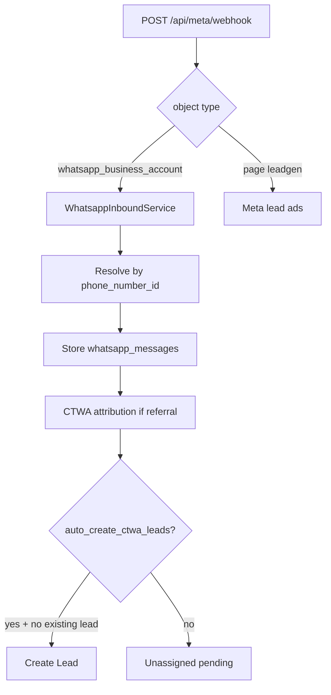

# WhatsApp Meta App Runbook

Guide for enabling official WhatsApp Cloud API (and Click-to-WhatsApp attribution) on the **shared Meta App**, after App Review. Until then, tenants use **manual token** entry and/or **WhatsApp Mirror**.

## Architecture (current)

- **Same shared Meta App** as Marketing (Super Admin → System Integrations).
- **One global webhook**: `{API_URL}/api/meta/webhook` — handles both Page (`leadgen`) and WhatsApp (`whatsapp_business_account`) objects.
- **Per-tenant WhatsApp channel** in `whatsapp_channels` (phone number id + token), separate from Marketing page OAuth.
- **Outbound routing**: latest message `channel_id` that is still sendable (`connected` / `migrating`) → else `is_primary` → else legacy `whatsapp_settings`.
- **CTWA**: referral on inbound Cloud messages → `whatsapp_message_attributions`; optional auto-lead via `whatsapp_settings.auto_create_ctwa_leads` (default `false`).



## Simplified tenant connect (after App Review)

Set in API env:

```bash
WHATSAPP_OAUTH_ENABLED=true
WHATSAPP_EMBEDDED_SIGNUP_CONFIG_ID=your_meta_embedded_signup_config_id
php artisan config:clear
```

| Mode | When | Tenant experience |
|------|------|-------------------|
| **Embedded Signup** | OAuth on + config ID set | One button → Meta popup → number registered/linked |
| **OAuth redirect** | OAuth on, no config ID | One button → Meta login → import existing WABA phones |
| **Manual token** | OAuth off (default now) | Paste token + phone number id |

Endpoints:

- `GET /api/auth/whatsapp/status` — `connect_mode`, `embedded_signup_available`, `meta_app_id`
- `GET /api/auth/whatsapp/redirect` — classic OAuth URL
- `POST /api/auth/whatsapp/embedded-signup` — `{ code, phone_number_id?, waba_id? }`

Create the Embedded Signup configuration in Meta Developer Console (WhatsApp → Configuration → Embedded Signup) and paste its config ID into `WHATSAPP_EMBEDDED_SIGNUP_CONFIG_ID`.

## Before App Review (today)

1. Tenant Admin → **Settings → WhatsApp → Connection**: enter Cloud **access token**, **phone number id**, business number.
2. Keep Mirror on a **different** phone number if both run on the same tenant.
3. Unassigned / CTWA contacts: **Settings → WhatsApp → Unassigned** tab.
4. Leave `WHATSAPP_OAUTH_ENABLED=false` (default).

## Meta Developer Console checklist (when App is ready)

1. Open the shared app in [Meta Developers](https://developers.facebook.com/apps/).
2. Add **WhatsApp** product; complete Business verification / App Review as required.
3. **Webhooks** (same callback as Marketing):
   - Callback URL: `{API_URL}/api/meta/webhook`
   - Verify Token: Super Admin `meta_verify_token` (same as Marketing)
   - Subscribe to WhatsApp fields: at least `messages`
4. Request WhatsApp scopes / permissions needed for Cloud messaging and (if used) ads attribution enrichment.
5. Optional OAuth / Embedded Signup: only after Review — then set env and redeploy (below).

## Environment

| Variable | Purpose |
|----------|---------|
| `WHATSAPP_OAUTH_ENABLED` | `false` until Review; set `true` to expose Connect via Meta |
| `FACEBOOK_VERIFY_TOKEN` / Super Admin `meta_verify_token` | Webhook verify (shared) |
| `WHATSAPP_WEBHOOK_VERIFY_TOKEN` | Legacy WhatsApp-only verify fallback |
| `APP_URL` | Base for webhook URLs shown in Super Admin |

```bash
# api/.env — keep false until ready
WHATSAPP_OAUTH_ENABLED=false
```

After enabling OAuth:

```bash
WHATSAPP_OAUTH_ENABLED=true
php artisan config:clear
```

## Manual token path (supported long-term)

1. Create / link WhatsApp Business phone in Meta Business Manager.
2. Generate a permanent System User token (or temporary token for testing).
3. In CRM: **WhatsApp → Connection** → save token + phone number id.
4. Send a test inbound message to the business number; confirm it appears in Lead chat or Unassigned.
5. For CTWA ads: run Click-to-WhatsApp ads against that Cloud number; confirm attribution on the message and (optionally) enable **Auto-create leads from Click-to-WhatsApp ads**.

## Migration Mirror → Cloud

1. Connect Cloud channel with the **same** phone number as Mirror (migration flow in Channels UI).
2. Send verification message / wait for inbound test.
3. Complete migration — Mirror becomes `archived`; outbound must not use archived channels (resolver falls back to primary Cloud).

## Smoke tests after App / webhook change

```bash
php artisan migrate
php artisan test --filter=WhatsappChannels
```

Manual:

1. `GET /api/meta/webhook?hub.mode=subscribe&hub.verify_token=...&hub.challenge=ok` → returns challenge.
2. Inbound text to Cloud number → row in `whatsapp_messages` with `channel_id`.
3. Inbound with `referral` → row in `whatsapp_message_attributions`.
4. Lead reply from CRM → outbound uses conversation channel (not wrong archived Mirror).

## Related docs

- [meta-shared-app-runbook.md](./meta-shared-app-runbook.md) — shared app, Marketing webhook, Super Admin credentials.
